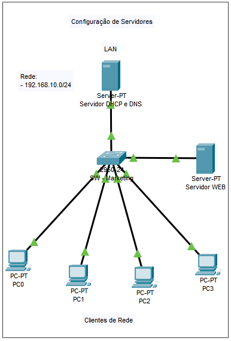
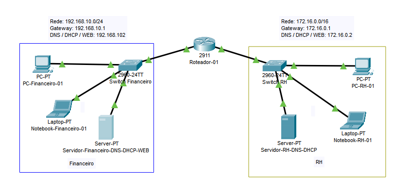

## DevOps_Ada-Tech_redes
- Repositório contendo os arquivos de simulação usando Cisco Packet Tracer.
- Atividades feitas no módulo de redes do curso DevOps - Vem Ser Tech.
___
#### Conexão com servidores (DHCP, DNS e HTTP) e configurações da rede (IPs estáticos, atribuição via DHCP, Gateway e Broadcast)

___
#### Conexões entre redes (Uso de roteadores e configurações de Gateway)

