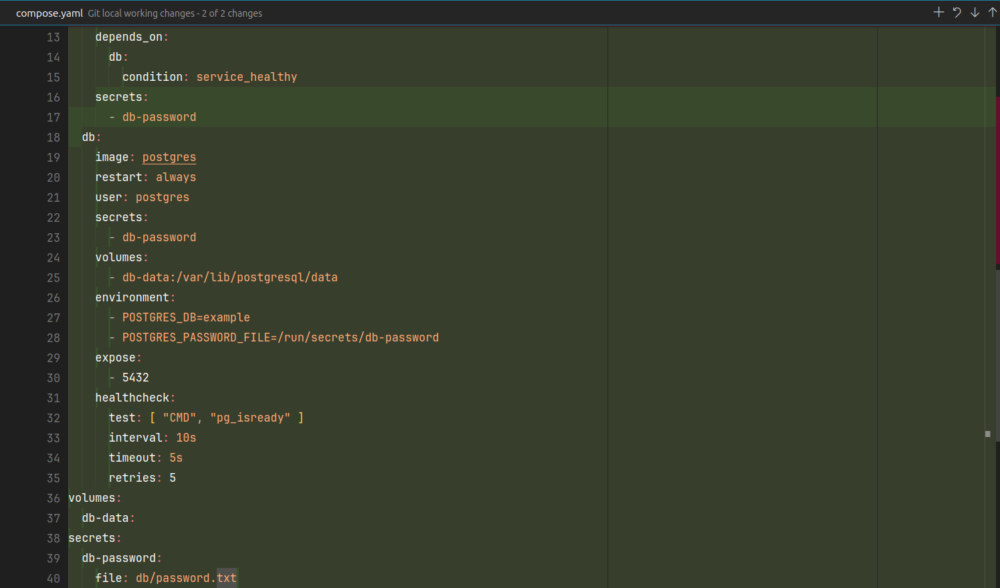

# Conteinerizando uma aplicação NodeJS

Essa aplicação NodeJS foi pegada da documentação do Docker, sendo possível acessa-la por [aqui](https://docs.docker.com/language/nodejs/containerize/). Nela, temos todos os passo a passo de como conteineriza-la e sincronizar com um banco de dados.

## Grupo 5 - Turma #1099

- Vinicius Piotto
- Andrea Gonçalves
- Alan de Oliveira Gonçalves
- Jucilene Lemos Barboza
- André Felipe

## Clonando a aplicação

O primeiro passo é clonar a aplicação, ou seja, um pré-requisito desse projeto é você ter a ferramenta Git instalada em sua máquina.

Com o Git instalado, basta rodar esse comando:
```
git clone https://github.com/docker/docker-nodejs-sample
```

### Criando os arquivos do Docker

Existem duas formas de criar os arquivos Docker na sua aplicação, a maneira manual, quando você cria o Dockerfile e faz ele passo a passo, podendo ser melhor em aplicações mais específicais, nas quais você tem conhecimento e um dominio maior sobre a ferramenta. Outra maneira, é pelo comando abaixo:

```
docker init
```

> [!IMPORTANTE]  
> Vale ressaltar que nesse ponto, deve estar instaldo e configurado o Docker na sua máquina para que tudo ocorra certo.

Algumas perguntas básicas serão feitas após o comando:


Nessa primeira opção, você deve escolher qual a linguagem da sua aplicação, no nosso caso de exemplo, eu vou escolher a linguagem Node. Depois, será perguntado a versão que a sua aplicação está rodando e qual instalador de pacotes está sendo utilizado, portanto, perguntas pessoais para cada projeto.


Nessa etapa, é de grande importancia, pois, vamos ter que passar o caminho no qual o arquivo da aplicação está, no meu caso, devo localizar o arquivo ```index.js```. Vou analisar a organização das pastas para te mostrar o caminho que estou utilizando:


Com o comando finalizado, foram criados vários arquivos. Mas vamos analisar os 2 mais importantes a seguir:

## Dockerfile


1. **ARG NODE_VERSION=18.0.0**:
   - Define uma variável de argumento chamada NODE_VERSION com o valor padrão de 18.0.0. Essa variável será usada posteriormente para definir a versão do Node.js na imagem.

2. **FROM node:${NODE_VERSION}-alpine**:
   - Usa a imagem oficial do Node.js do Docker, com a versão definida pela variável NODE_VERSION, baseada na distribuição Alpine Linux. O Alpine Linux é uma distribuição leve.

3. **ENV NODE_ENV production**:
   - Define a variável de ambiente NODE_ENV como "production". Isso é comum ao construir imagens Docker para aplicativos Node.js para garantir que as dependências de desenvolvimento não sejam instaladas.

4. **WORKDIR /usr/src/app**:
   - Define o diretório de trabalho dentro do contêiner como /usr/src/app. Isso é o local onde os comandos subsequentes serão executados.

5. **RUN --mount=type=bind,source=package.json,target=package.json \ 
--mount=type=bind,source=package-lock.json,target=package-lock.json \ 
--mount=type=cache,target=/root/.npm \ 
npm ci --omit=dev**:
   - Usa a instrução RUN para executar comandos durante a construção da imagem. Neste caso, está usando a instrução --mount para montar os arquivos package.json e package-lock.json do host para o contêiner. Isso é feito para permitir que o npm ci (instalação limpa) seja executado usando esses arquivos. O cache npm também é montado para acelerar futuras instalações de dependências.

6. **USER node**:
   - Define o usuário que será usado para executar os comandos subsequentes no Dockerfile como "node". Isso é uma prática comum para melhorar a segurança, minimizando o risco de execução de comandos como root.

7. **COPY . .**:
   - Copia todos os arquivos do diretório atual do contexto de construção (onde o Dockerfile está localizado) para o diretório de trabalho no contêiner (/usr/src/app).

8. **EXPOSE 80**:
   - Informa ao Docker que o contêiner escutará na porta 80 durante a execução. Isso não publica automaticamente a porta, mas é uma documentação útil para entender como o contêiner deve ser usado.

9. **CMD node src/index.js**:
   - Define o comando padrão que será executado quando o contêiner for iniciado. Neste caso, inicia o aplicativo Node.js localizado em src/index.js.

##  compose.yaml

```
services:
  server:
    build:
      context: .
    environment:
      NODE_ENV: production
    ports:
      - 80:80
```

- **services**: Esta seção é usada para definir os diferentes serviços (contêineres) que compõem sua aplicação. No exemplo, há um serviço chamado "server".

- **server**: É o nome do serviço. Poderia ser qualquer nome que você escolher para identificar esse serviço.

- **build**: Indica como construir a imagem para este serviço. No caso, o contexto de construção é o diretório atual (`.`), o que significa que o Docker usará os arquivos no diretório atual para construir a imagem. Pode incluir outros parâmetros, como `Dockerfile` para especificar um arquivo Dockerfile diferente.

- **environment**: Define variáveis de ambiente para o serviço. Aqui, está definindo a variável de ambiente `NODE_ENV` como "production". Isso é semelhante à instrução `ENV` no Dockerfile e define o ambiente Node.js como "production".

- **ports**: Mapeia as portas do host para as portas do contêiner. Neste exemplo, a porta 80 do host é mapeada para a porta 80 do contêiner. Isso significa que o serviço dentro do contêiner que estiver ouvindo na porta 80 estará acessível do lado de fora do contêiner através da porta 80 do host.

## Execução inicial


Acessando o http://localhost:80 podemos conferir que a aplicação está rodando perfeitamente:


## Adicionando banco de dados e volumes para a aplicação

Para expandir as configurações do projeto e incluir um serviço de banco de dados PostgreSQL (db) utilizando segredos (Secrets) para gerenciar informações sensíveis, como senhas e etc. Algumas modifições foram necessárias no ```compose.yaml```:

### Modificando o compose.yaml para banco de dados




Resumidamente, para explicar o que modificamos:

- **services**: Esta seção ainda define os serviços que compõem a aplicação. Agora, há dois serviços, "server" e "db".

  - **server**: Configurações para o serviço da aplicação. As variáveis de ambiente relacionadas ao PostgreSQL indicam como a aplicação se conectará ao banco de dados.

  - **db**: Configurações para o serviço do banco de dados PostgreSQL. Usa a imagem oficial do PostgreSQL. As configurações incluem volume para persistência de dados, exposição da porta 5432, e um healthcheck para verificar a disponibilidade do PostgreSQL.

- **depends_on**: Garante que o serviço "server" só será iniciado após o serviço "db" estar saudável. Isso não garante que o PostgreSQL dentro do serviço "db" está totalmente inicializado, apenas que o contêiner está em execução.

- **secrets**: Permite o uso de segredos para gerenciar informações sensíveis. Neste caso, um segredo chamado "db-password" é definido para armazenar a senha do PostgreSQL. O arquivo de senha é lido do caminho especificado no host (`db/password.txt`) e é disponibilizado para os serviços no caminho `/run/secrets/db-password` dentro dos contêineres.

- **volumes**: Define um volume chamado "db-data" que é utilizado para persistir os dados do PostgreSQL. Isso é essencial para garantir que os dados não se percam quando o contêiner é reiniciado.

- **secrets**: Define o segredo chamado "db-password" e especifica o arquivo no host que contém a senha. Este segredo é então referenciado nos serviços que precisam da senha, como "server" e "db".

> [!WARNING]  
> Antes de realizar o ```docker compose up``` novamente, vale ressaltar que deve ser criado uma pasta contendo um arquivo ```password.text```, responsável por passar a senha da aplicação, assim como modificamos e explicamos anteriormente.


## Etapas finais

Com tudo finalizado e configurado certinho, podemos executar novamente o comando ```docker compose up``` e ver o resultado:

### terminal


### Projeto final

